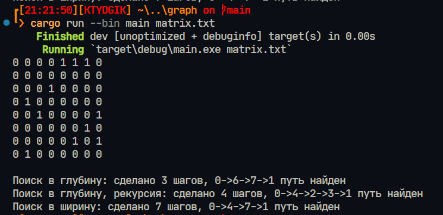

# Graph

Программа для изучения различный методов поиска пути в графах.

## Запуск

Для запуска требуется установленный rust

```rust
cargo run --bin main <путь до файла>
```
Либо файл main.exe, который по умолчанию использует граф matrix.txt:
```
target/release/main.exe
```

## Файловая система

list.rs - содержит структуру List над вектором, которая разрешает использовать над ним только заданные функцию

search.rs - содержит все три функции на поиск в графе + функция на построение пути

graph_func.rs - содержит функции для получения матрицы и вывода ее в консоль

family.rs - попытка сделать лист для построения пути, в программе не используется

## Пример работы
